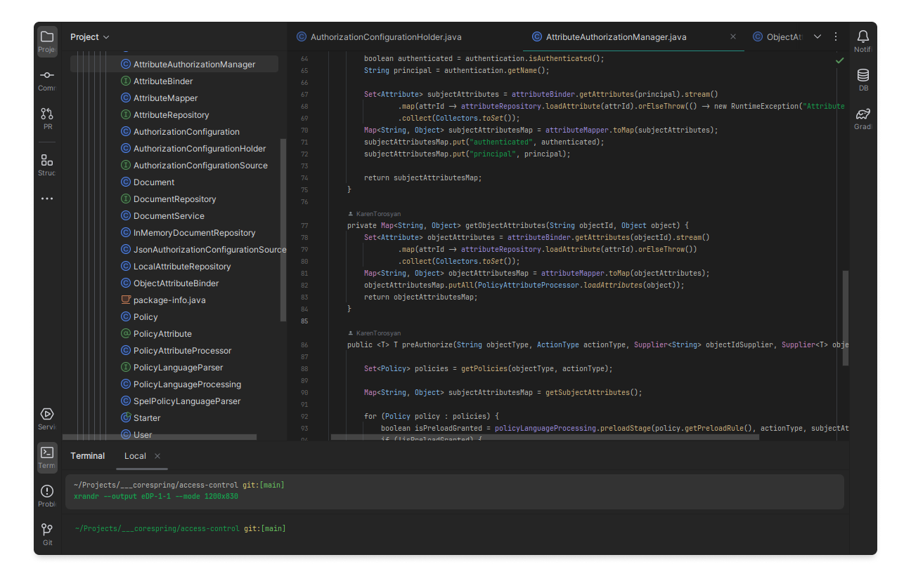
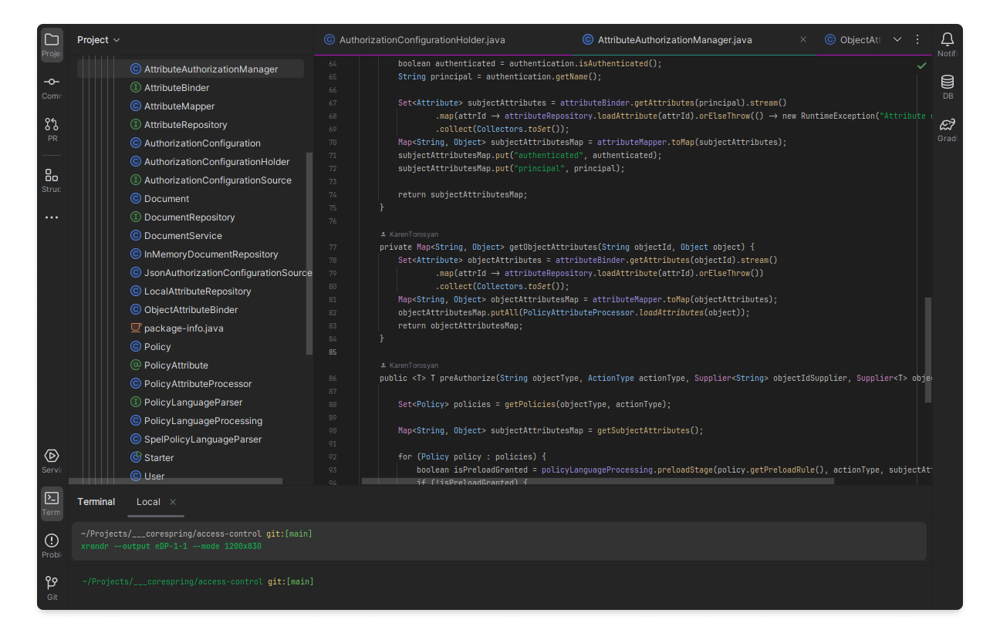

# Theme for JetBrains IDEs

This plugin includes a dark, darker and white UI with color schemes for all supported languages.

## Install

Install from [JetBrains Marketplace](https://plugins.jetbrains.com/plugin/24554-gnome-theme) or locally `Settings > Plugins > Install Plugin from Disk...` [releases](https://github.com/KarenTorosyan/intellij-ide-gnome-theme-plugin/releases)

### Select the theme in Settings > Appearance & Behavior > Appearance and apply

- Gnome R1 Dark or Darker (Flat, Blue)
- Gnome R1 Light (Flat, Pink)
- Gnome R2 Dark or Darker (Flat, Blue, Yellow, Orange, Purple)

## Screenshots

