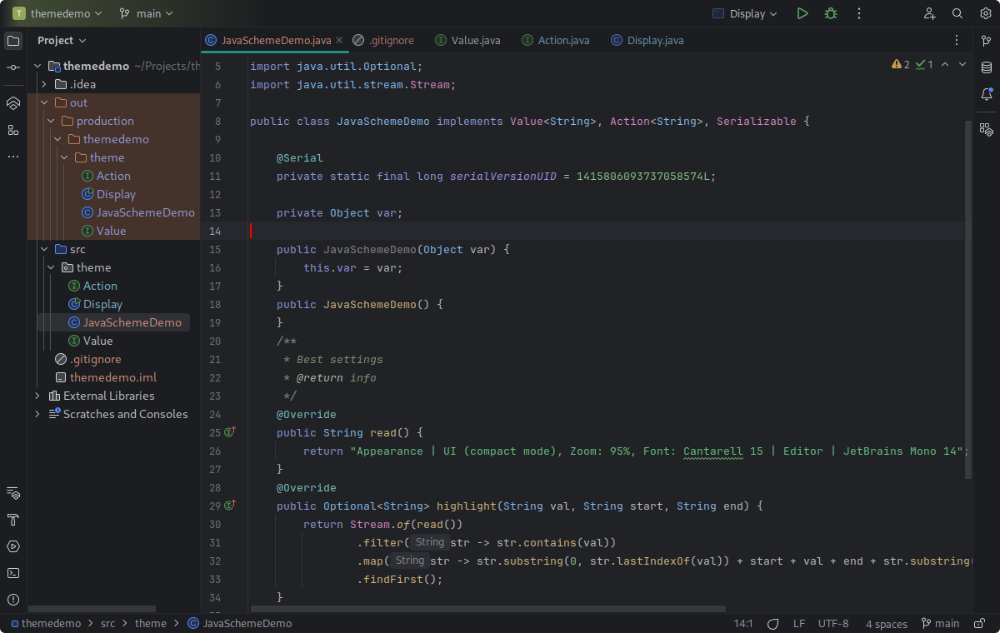

# Theme for JetBrains IDEs

This plugin includes a dark, darker and white UI with color schemes for all supported languages.

## Install

Install from [JetBrains Marketplace](https://plugins.jetbrains.com/plugin/24554-gnome-theme) or manually `Settings | Plugins | Install Plugin from Disk...` [releases](https://github.com/KarenTorosyan/intellij-ide-gnome-theme-plugin/releases)

Select the theme in `Settings | Appearance & Behavior | Appearance | Theme`

- GNOME Dark-Blue
- GNOME Dark-Grey
- GNOME Darker-Grey
- GNOME Light

